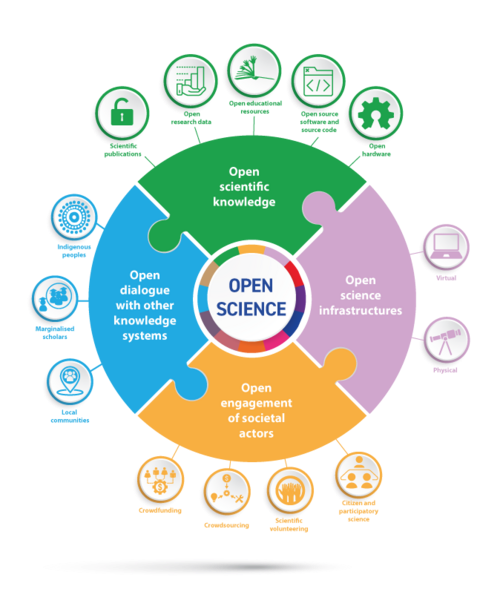
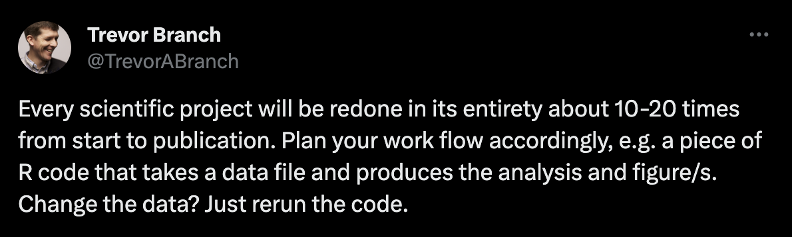

## What is Open Science?

## Why Open Science?

## Why Open Science?

- Trust

- Accelerate science

- Exposure

- Citations

- ...

## Risks of Open Science?

## Risks of Open Science?

- Spoilers

- Miss-use

- Exposure

- Extra effort

- ...

## Open Science?

- Replicability: same/similar methods, different data

- Reproducibility: same methods, same data

## Is Ecology replicable?

## Why reproducibility?

- For you: Plan Ahead

  

## Is Science reproducible?

## Data usability

- Meta-data

- Open formats

- Raw data

## Code availability?

{width="324"}

Culina et al. 2020 (Data: 2015-2019; n = 346)

## Can we do better?

## Open Science is hard

> "Caminante, no hay camino, se hace camino al andar" Machado et al. 1912 probably referring to open science

Open, reliable and transparent science is a path, not and end point.

## My path

- It took me 10 years to approach something I am comfortable calling Open Reliable Transparent science.

<!-- -->

- Work iteratively. One step at a time.

- We stand on the shoulders of giants such as [rOpenSci](https://ropensci.org/) , [SORTEE](https://sortee.org/), and [Paco Rodriguez](https://github.com/Pakillo) (or you don't need to walk this path alone, find your community)

## Conclusions

- It's hard work -\> Ensure to claim the credit you deserve

- You are more exposed -\> You faults will be seen as honest

- New tools and standards emerge every day -\> Work iteraltively and strive to do better, not to do it perfect.
